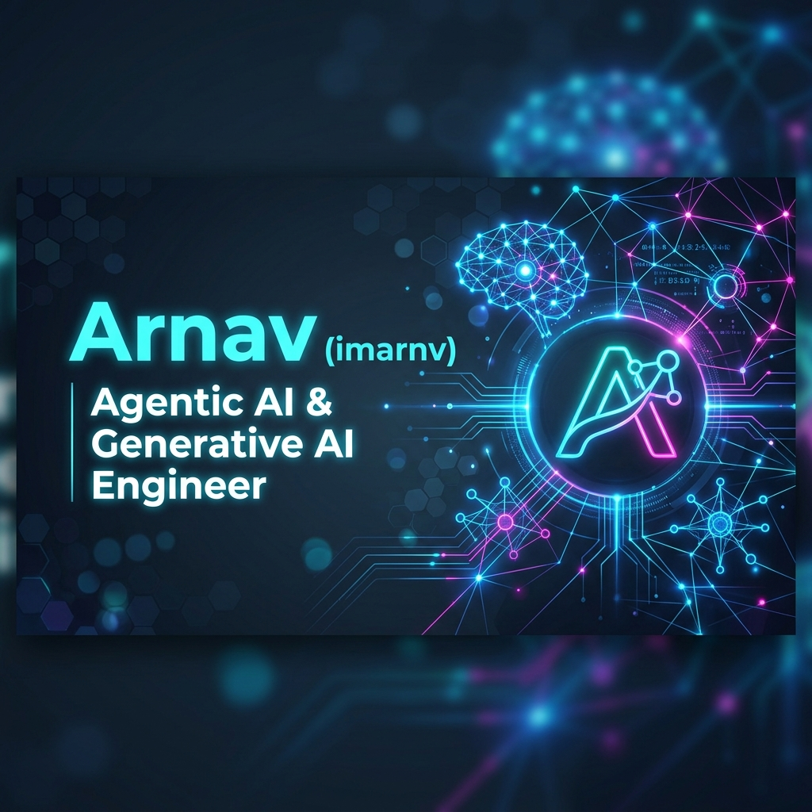

  

 

<h1 align="center">Hi there, I'm Arnav (imarnv) 👋</h1>

  

  
  

---

### 💫 About Me

I am an **AI Engineer** specializing in **Agentic AI**, **Generative AI**, and cognitive agent architectures. I build autonomous agents, design robust LLM pipelines, and integrate state-of-the-art AI systems with interactive applications.

* 🤖 I design intelligent multi-agent systems and custom tool-calling agents using frameworks like **LangChain**, **LangGraph**, and **AutoGen**.
* 🔭 I am currently working on **[Climate-Change (GWF-Vis)](https://github.com/imarnv/Climate-Change)**, integrating climate data structures with advanced visualizer controls.
* 🧠 Passionate about **Retrieval-Augmented Generation (RAG)**, structured output extraction, function calling, and vector search systems.
* ⚡ Fun fact: I design AI agents to solve real-world workflows, automating the path from raw data to actionable intelligence.

---

### 🛠️ AI & Tech Stack

#### 🤖 AI, LLM & Agent Frameworks

  
  
  
  
  
  
  

#### 💻 Languages & Core Backend

  
  
  
  
  
  
  

#### 💾 Databases & Vector Search

  
  
  
  

#### ⚙️ Infrastructure & Tools

  
  
  
  

---

### 👾 My Contribution Snake

  

 
